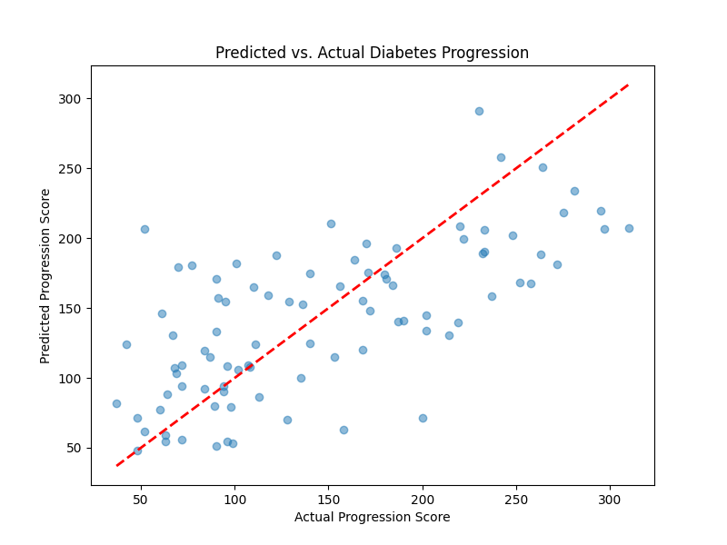

# Mini Machine Learning Demo: Diabetes Risk Prediction
This project predicts diabetes progression using linear regression with Python and Scikit-Learn.

## Dataset
- **Diabetes Dataset**: Built-in Scikit-Learn dataset with 442 patient records, including features like BMI, blood pressure, and a target progression score.

## Project
- [Diabetes Prediction Notebook](diabetes_prediction.ipynb)  
  

## Setup
1. Clone this repository: `git clone https://github.com/your-username/ml-diabetes-demo.git`
2. Install dependencies: `pip3 install -r requirements.txt`
3. Run Jupyter Notebook: `jupyter notebook`